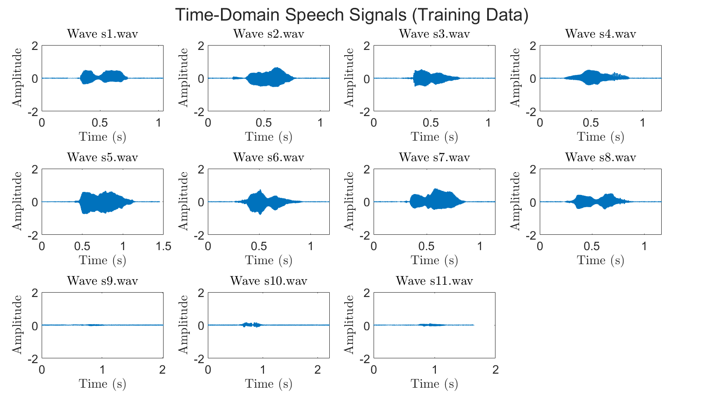
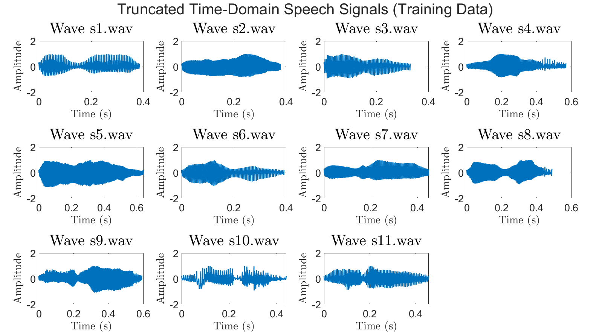
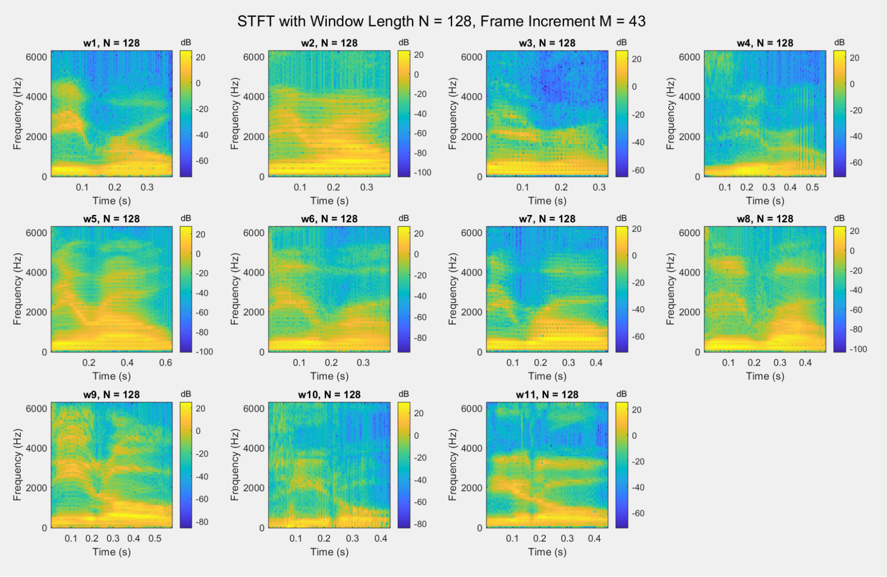
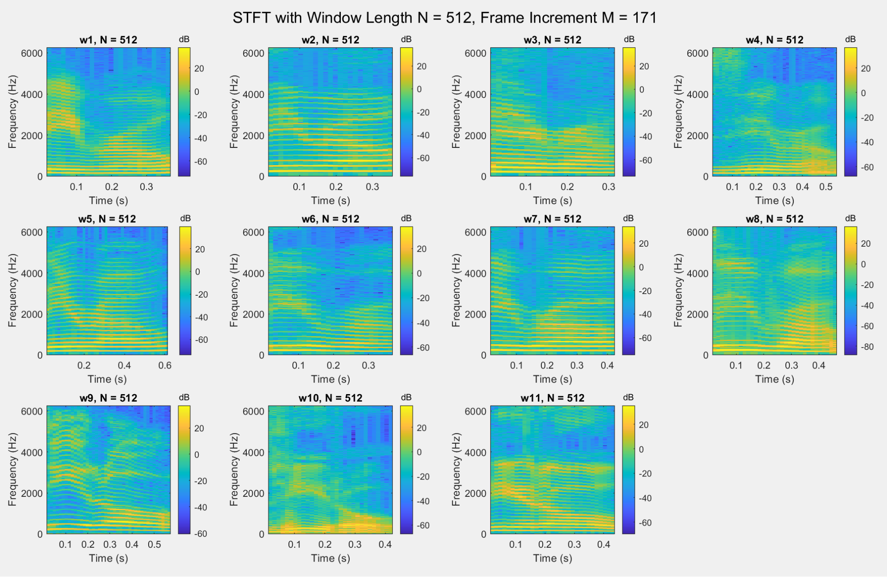
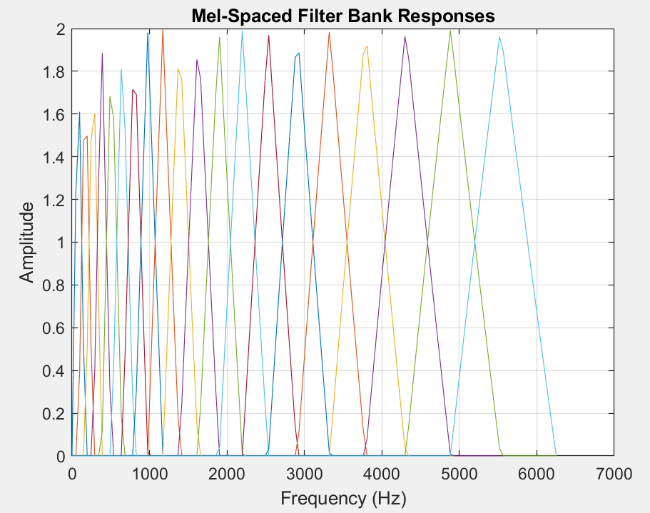
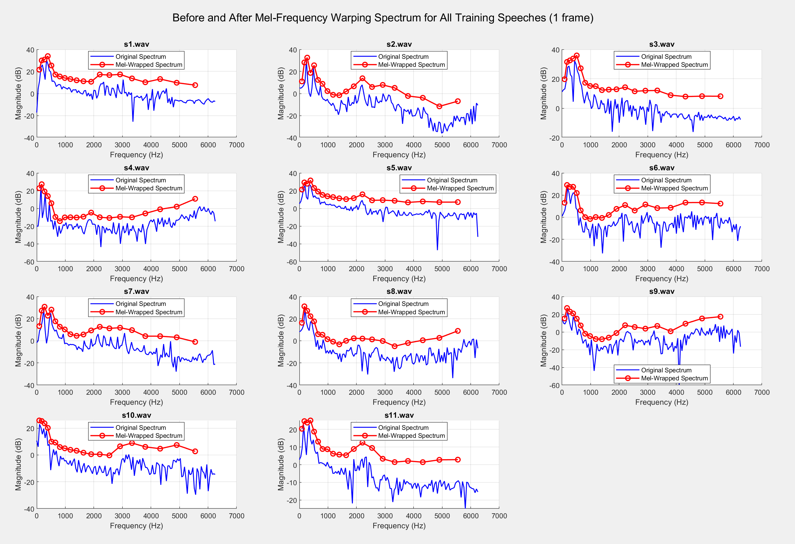
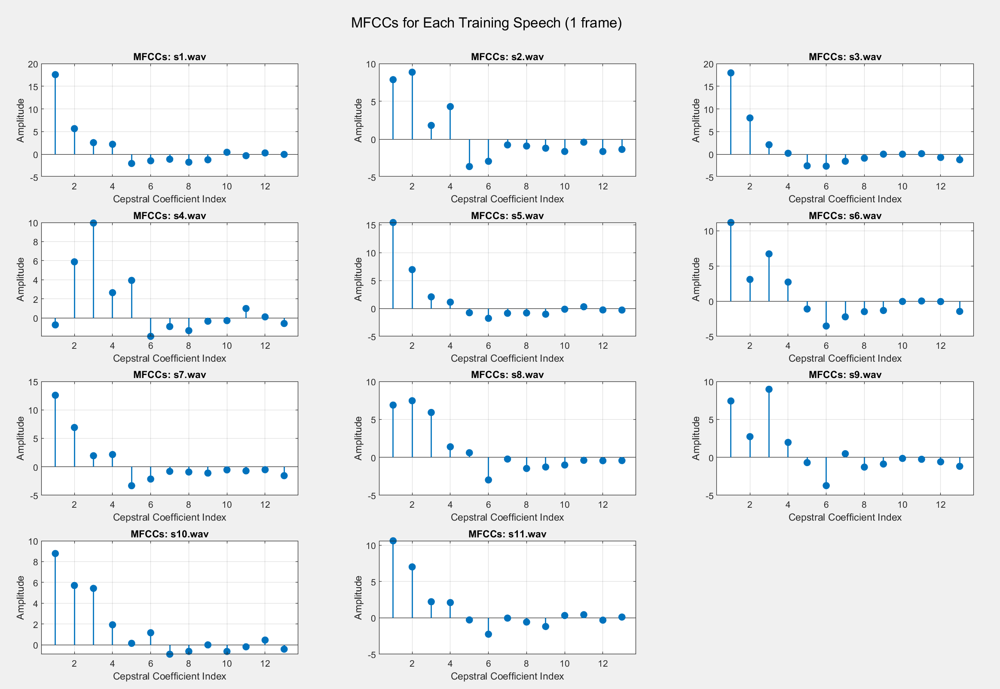
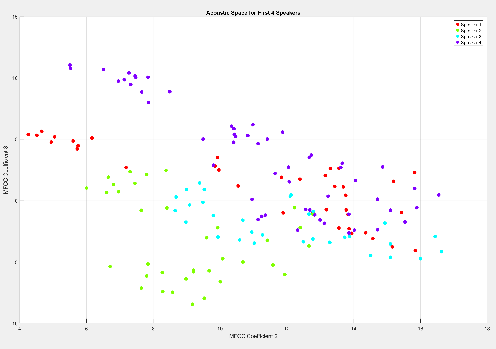
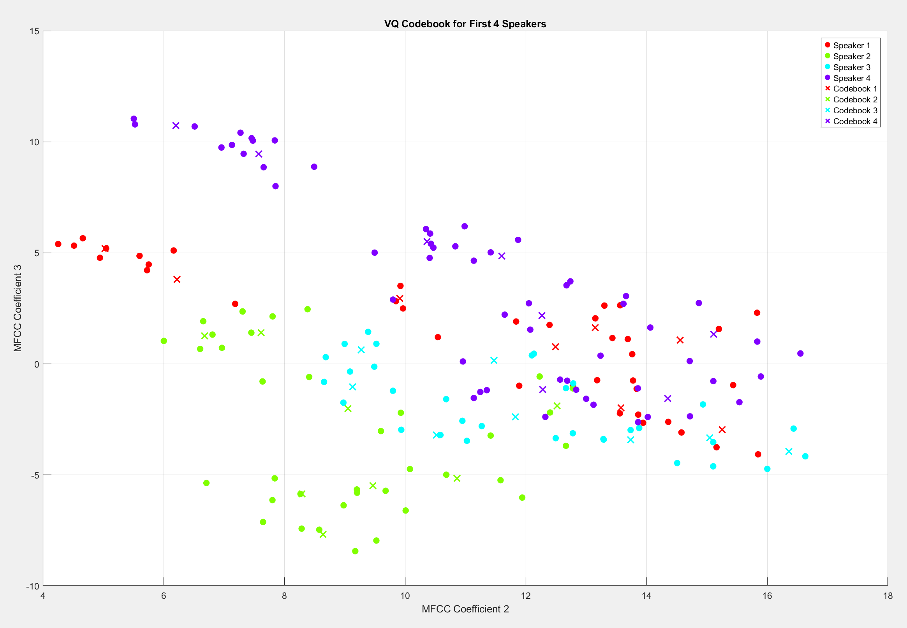

<div align="center">

# Speech Recognition

### Ryan Bruch, Haodong Liang

### March 14, 2025

</div>
<!-- <div style="text-align: center;">
  <h1 style="font-size: 40px;">Speech Recognition</h1>
  <h2>Ryan Bruch, Haodong Liang</h2>
  <h3>March 14, 2025</h3>
</div> -->
<!-- <style>
    h1, h2, h3 {
    border-bottom: none !important;
  }
    figure {
    text-align: center; /* Centers inline content like text */
    display: flex;
    flex-direction: column;
    align-items: center; /* Centers block content like the image */
  }
  p { font-size: 18px; }
    h1 { font-size: 30px; }
    h2 { font-size: 24px; }
    h3 { font-size: 18px; }
</style> -->

# Background
Speech recognition is the process of identifying a speaker based on the information encoded in the sound waves of their speech. This technology is ubiquitous in modern technology, especially with the rise of voice-controlled assistants. The goal of this project is to develop a simple yet effective method of speaker recognition using Digital Signal Processing Techniques. This will be accomplished in two phases: training and testing. In the training phase, speech samples from known speakers will be used to create a codebook with each speaker's unique voice profile. In the testing phase, the system will analyze speech from an unknown speaker, extract the key features, and match them against the stored codebooks to identify the speaker.

The core of the speaker recognition system relies on Mel-Frequency Cepstral Coefficients (MFCC) for feature extraction and Vector Quantization (VQ) for classification. The unique scaling of MFCCs captures the essential characteristics of speech by mimicking the human auditory system, while VQ groups the extracted features into clusters, forming a unique codebook for each speaker. By comparing the test signal with these codebooks, the system determines the speaker's identity based on the smallest distortion measure.

This report outlines the principles of speaker recognition, the methods used for feature extraction and matching, and the implementation of the recognition system using MATLAB. All the code for generating figures of the following analysis are contained in the folder /SpeechRecognition (see PartB.m, PartC.m, PartD.m). To test the accuracy of our model, run Main.m.

# Training The Model

The first step in this project was to acquire speech data. Each speaker was recorded saying a particular number twice; the first recording was used to train the model, and the second recording was put aside to test the accuracy of the model. 

The purpose of the training model is to extract the unique features of a particular speaker's voice in a way that doesn’t rely on a specific timing or volume of the speech sample. Therefore, the raw speech signals were truncated and normalized to unit amplitude.

<figure>
  
   <figcaption>Figure 1: Raw time-domain signal.</figcaption>
</figure>

<figure>
  
   <figcaption>Figure 2: Normalized & truncated time-domain signal.</figcaption>
</figure>

Human speech signal can be considered as stationary within a short period of time, but varies significantly over long periods of time. Therefore, Short Time Fourier Transform (STFT) was used to analyze the local spectrum within a window of size N. For each speech sample, we apply STFT with increment $M=\lceil\frac{N}{3}\rceil$ over the entire signal to create the spectrogram. Here we show the spectrograms with $N=128$ and $N=512$.

<figure>
  
   <figcaption>Figure 3: STFT with window size 128.</figcaption>
</figure>

<figure>
  
   <figcaption>Figure 4: STFT with window size 512.</figcaption>
</figure> 

As we can clearly see from the spectrograms, the power of the speech signal is more concentrated in low/medium frequencies (0-4000 Hz) than in high frequencies (4000-8000 Hz). Thus, we apply mel-frequency wrapping to the power spectrum. The mel-spaced filterbank has magnitude response as follows:

<figure>
  
   <figcaption>Figure 5: Mel-spaced filter bank response, with number of filters p=20.</figcaption>
</figure> 

These triangular-shaped filters are linearly spaced below 1000 Hz and logarithmically spaced above 1000 Hz. In this way, it captures more information of the spectrograms in low frequency range. Here we show the mel-spectrum coefficients of a single frame.

<figure>
  
   <figcaption>Figure 6: Mel-spaced filter bank response, with number of filters p=20.</figcaption>
</figure> 

Next, the Mel-Frequency Cepstral Coefficients (MFCC) were computed for each frame. The MFCCs are the Discrete Cosine Transform (DCT) of the mel spectrum coefficients. Below we show the MFCC of a single frame.

<figure>
  
   <figcaption>Figure 7: Mel-spaced filter bank response, with number of filters p=20.</figcaption>
</figure> 

In the following analysis, we take out the first component of MFCC as it represents the magnitude of the signal. 

The effectiveness of this method can be seen by plotting the MFCCs of multiple different speakers. For visualization purpose, we only plot the second vs. third MFCC coefficient.

<figure>
  
   <figcaption>Figure 8: Acoustic Space (MFCC coefficient for different speakers).</figcaption>
</figure> 

As it can be seen from the figure, each speaker is likely to form a separate cluster of MFCC coefficients in the acoustic space. 

Next, we applied Vector Quantization (VQ) to create a codebook for each speaker. The well known Linde-Buzo-Gray (LBG) Algorithm was used to find the centroids of each cluster, which served as the unique codebook for each speaker. 

<figure>
  
   <figcaption>Figure 9: VQ codebooks for each speaker in acoustic space.</figcaption>
</figure> 

In order to identify an unknown speaker, we can extract the MFCCs from a speech sample and compare them to the codebook of each known speaker. For each codebook, the model will find the total amount of distortion (measured in Euclidean distance) required to map each codeword to its nearest data point. Then, the speaker associated with the codebook that yielded the smallest distortion will be selected as the recognized speaker. 

We tested the model on a small dataset to confirm that it is working. The dataset consisted of the speech signal "Zero" for 8 different speakers. The model was initialized with reasonable parameters and was able to correctly identify 7/8 speakers, resulting in a 87.5% accuracy and proving that the model was functioning correctly

# Optimizing the model

The next step was to optimize the parameters of the model. We had two more datasets available: the "Zero" and "Twelve" speech signals from 2024 and "Five" and "Eleven" from 2025. Our approach was to first create a script that would loop through several different values of each parameter and test the resulting accuracy of our system on all data available. The top performing parameters from this method were then fed into a genetic algorithm in MATLAB to further optimize their performance. The best performing set of parameters was found to be:


```matlab
fs_mel       = 12500;  % Sampling rate used for mel filter bank
p            = 62;     % Number of mel filters
n            = 1024;    % FFT length
nc           = 27;     % Number of MFCC coefficients to keep
frameLen     = 355;    % Frame length in samples
overlap      = 232;    % Overlap between frames (in samples)
numCodewords = 30;      % Desired number of VQ codewords per speaker
epsilon      = 0.0001; % Splitting factor for the LBG algorithm
distortionThreshold = 0.000001; % Convergence Threshold for the LBG algorithm
keepfirst = false; % Whether or not keep the first MFCC coefficient
```

## Results

### "Zero" speeches

This dataset contains the speech signals of "zero" for 8 different speakers. Our model yields 87.5% accuracy on the test set. To test the robustness, we apply 4 different notch filters on the test signals with notch frequencies placed at 800, 1000, 1200, 1400 Hz respectively. All the test accuracies remain at 87.5%, which indicates the system is quite robust.

On top of these 8 speeches, we add 10 student's "zero" speeches from the EEC 2024 students and re-train a new model to recognize these 18 speakers together. The accuracy for this new task is 94.44% on the test set.

### "Zero" and "Twelve" speeches

This dataset contains the speech signals of "zero" and "twelve" of 18 students in the EEC 2024 class. We first try to identify the speakers with "Zero" and "Twelve" signal respectively. The corresponding test accuracies are both 94.44%. Next, we consider a more challenging case where the system in trained to identify a) which speaker, and b) whether the speech is "zero" or "twelve", at the same time. The test accuracy for this whole system remains at 94.44%.

### "Five" and "Eleven" speeches

This dataset contains the speech signals of "five" and "eleven" of 23 students in the EEC 2025 class. Similarly, we first identify the speakers with "Five" speech, the resulting test accuracy hits 100%. We then identify the speakers with "Eleven" speech, the resulting test accuracy is also 100%. 

In conclusion, our model is capable of identifying different speakers with high accuracy and good robustness.

